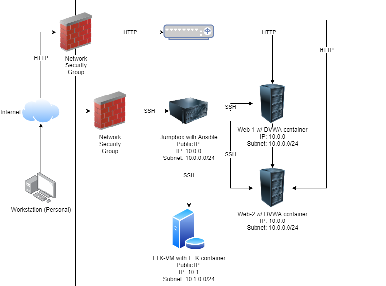

## Automated ELK Stack Deployment

The files in this repository were used to configure the network depicted below.



These files have been tested and used to generate a live ELK deployment on Azure. They can be used to either recreate the entire deployment pictured above. Alternatively, select portions of the `install-elk.yml` file may be used to install only certain pieces of it, such as Filebeat.

  - _[Install-Elk Playbook](Ansible/install-elk.yml)._

This document contains the following details:
- Description of the Topologu
- Access Policies
- ELK Configuration
  - Beats in Use
  - Machines Being Monitored
- How to Use the Ansible Build


### Description of the Topology

The main purpose of this network is to expose a load-balanced and monitored instance of DVWA, the D*mn Vulnerable Web Application.

Load balancing ensures that the application will be highly available, in addition to restricting access to the network.
- _What aspect of security do load balancers protect? What is the advantage of a jump box?_
  - The security aspect of load balancers help mitigate against denial of service attacks. The advantage of a jumpbox on the other hand limits the amount of attack vectors that can access our internal network. 

Integrating an ELK server allows users to easily monitor the vulnerable VMs for changes to the configuration files and system logs.
- _TODO: What does Filebeat watch for?_
  - Filebeat watches for sudo commands, SSH logins, and system logs 
- _TODO: What does Metricbeat record?_
  - Metricbeat watches for CPU usage, RAM, and network usage.

The configuration details of each machine may be found below.

| Name     | Function | IP Address | Operating System |
|----------|----------|------------|------------------|
| Jump Box | Gateway  | 10.0.0.1   | Linux            |
| Web-1     | Webserver          |            | Linux                 |
| Web-2     | Webserver         |            |                  |
| ELK-VM    | SIEM (System Information Event Manager)  |            |                  |

### Access Policies

The machines on the internal network are not exposed to the public Internet. 

Only the `Jumpbox` machine can accept connections from the Internet. Access to this machine is only allowed from the following IP addresses:
- _The only IP address that can access the Jumpbox is my personal IP address because the firewall settings have been set to only my IP address being able to access to the Jumpbox. This helps decrease the attack vector since the only way to access the internal network is through the Jumpbox._

Machines within the network can only be accessed by `Ansible Container`.
- _Which machine did you allow to access your ELK VM? What was its IP address?_
  - The `Ansible Container` is the only one that can SSH into the ELK VM and its IP address is ___

A summary of the access policies in place can be found in the table below.

| Name     | Publicly Accessible | Allowed IP Addresses |
|----------|---------------------|----------------------|
| Jump Box | Yes              | My IP Address   |
| Web-1  | w/ HTTP (Yes) & w/ SSH (No)                   |                      |
| Web-2          | w/ HTTP (Yes) & w/ SSH (No)                     |                      |
| Elk-VM         | w/ HTTP (Yes) & w/ SSH (No)                     |                      |

### Elk Configuration

Ansible was used to automate configuration of the ELK machine. No configuration was performed manually, which is advantageous because...
- _What is the main advantage of automating configuration with Ansible?_
  - This allows us to save time and prevent human errors when trying to configure multiple machines within the network. This also allows us to perform version control on certain patches we would like to apply in the near future. 

The playbook implements the following tasks:
- _TODO: In 3-5 bullets, explain the steps of the ELK installation play. E.g., install Docker; download image; etc._
- 1. Install docker.io
- 2. Install python3-pip
- 3. Download and launch an ELK container
- 4. Enable the service for docker on boot.

The following screenshot displays the result of running `docker ps` after successfully configuring the ELK instance.


### Target Machines & Beats
This ELK server is configured to monitor the following machines:
- _List the IP addresses of the machines you are monitoring_
  -  Web-1:
  -  Web-2:

We have installed the following Beats on these machines:
- _Specify which Beats you successfully installed_
  - Filebeat

These Beats allow us to collect the following information from each machine:
- _In 1-2 sentences, explain what kind of data each beat collects, and provide 1 example of what you expect to see. E.g., `Winlogbeat` collects Windows logs, which we use to track user logon events, etc._
  - Filebeat will collect SSH logins, system logs, and sudo commands 

### Using the Playbook
In order to use the playbook, you will need to have an Ansible control node already configured. Assuming you have such a control node provisioned: 

SSH into the control node and follow the steps below:
- Copy the `/etc/ansible/filebeat-config.yml` file to `/etc/filebeat/filebeat.yml`.
- Update the `/etc/filebeat/filebeat.yml` file to include...
 ```output.elasticsearch:
  hosts: ["localhost:9600"]
  username: "elastic"
  password: "password"
setup.kibana:
  host: "localhost:5601"
```
- Run the playbook, and navigate to `/etc/filebeat` to check that the installation worked as expected.

_Answer the following questions to fill in the blanks:_
- _Which file is the playbook? Where do you copy it?_
  - Copy the `/etc/ansible/filebeat-config.yml` file to `/etc/filebeat/filebeat.yml`.
- _Which file do you update to make Ansible run the playbook on a specific machine? How do I specify which machine to install the ELK server on versus which to install Filebeat on?_
  - We will update the `hosts` file in order to specific which machine the playbook should run on. To specific which machine to install certain items on, we would need to specify the groups in the `hosts`.
- _Which URL do you navigate to in order to check that the ELK server is running_?
   - http://137.135.69.18:5601/
